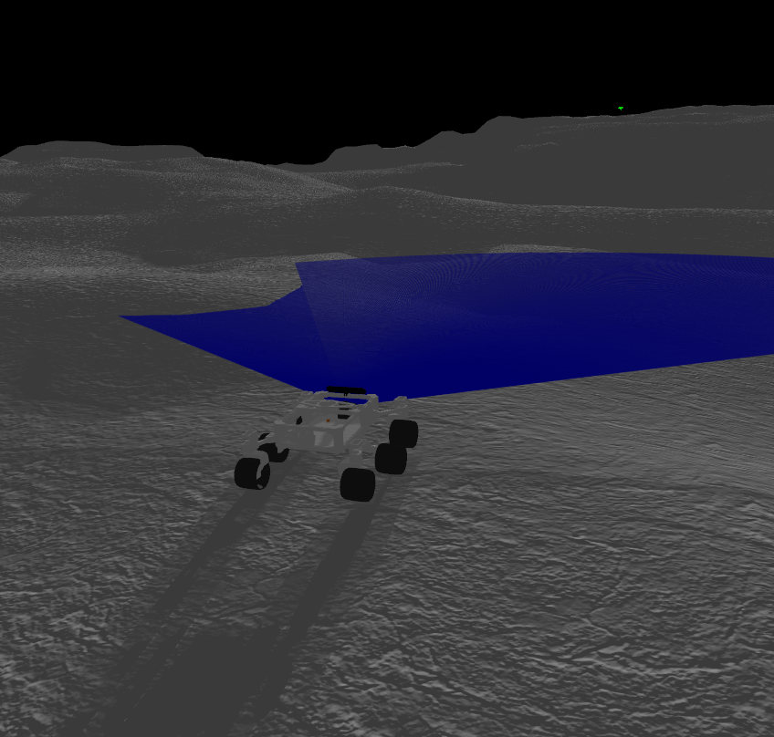
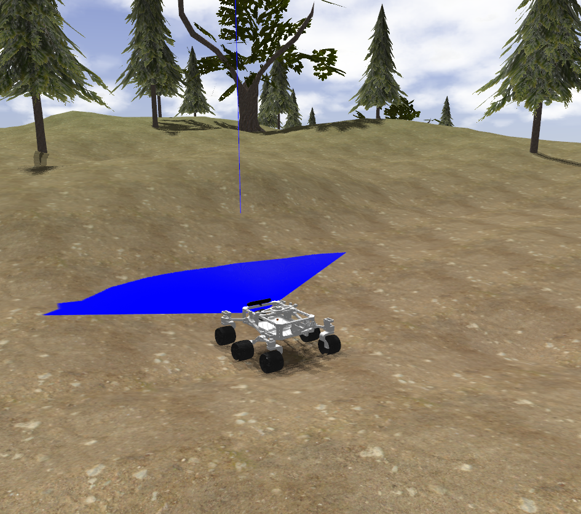

# ros2_rover

This is a ROS 2 (Humble) version of the [Sawppy the Rover](https://github.com/Roger-random/Sawppy_Rover). A [C++](./rover_motor_controller_cpp) version and a [Python](./rover_motor_controller) version of the lx16a controller are included. Besides, a [PS3 joy controller](./rover_bringup/launch/joy_teleop.launch.py) and a [hokuyo laser](./rover_bringup/launch/urg_node.launch.py) can be used.

[](https://opensource.org/license/mit) [](https://github.com/mgonzs13/ros2_rover/releases) [](https://github.com/mgonzs13/ros2_rover?branch=main) [](https://github.com/mgonzs13/ros2_rover/commits/main) [](https://github.com/mgonzs13/ros2_rover/issues) [](https://github.com/mgonzs13/ros2_rover/pulls) [](https://github.com/mgonzs13/ros2_rover/graphs/contributors) [](https://github.com/mgonzs13/ros2_rover/actions/workflows/python-formatter.yml?branch=main) [](https://github.com/mgonzs13/ros2_rover/actions/workflows/cpp-formatter.yml?branch=main)

<div align="center">

| ROS 2 Distro |                           Branch                           |                                                                                                      Build status                                                                                                       |                                                             Docker Image                                                             | Documentation                                                                                                                                              |
| :----------: | :--------------------------------------------------------: | :---------------------------------------------------------------------------------------------------------------------------------------------------------------------------------------------------------------------: | :----------------------------------------------------------------------------------------------------------------------------------: | ---------------------------------------------------------------------------------------------------------------------------------------------------------- |
|  **Humble**  | [`main`](https://github.com/mgonzs13/ros2_rover/tree/main) | [](https://github.com/mgonzs13/ros2_rover/actions/workflows/humble-docker-build.yml?branch=main) | [](https://hub.docker.com/r/mgons/rover/tags?name=humble) | [](https://mgonzs13.github.io/ros2_rover/) |
|   **Iron**   | [`main`](https://github.com/mgonzs13/ros2_rover/tree/main) |    [](https://github.com/mgonzs13/ros2_rover/actions/workflows/iron-docker-build.yml?branch=main)    |   [](https://hub.docker.com/r/mgons/rover/tags?name=iron)   | [](https://mgonzs13.github.io/ros2_rover/) |

</div>

## Table of Contents

1. [Installation](#installation)
2. [Usage](#usage)
   - [Linux Service](#linux-service)
3. [Docker](#docker)
4. [Gazebo Simulation](#gazebo-simulation)
5. [Citations](#citations)

## Installation

```shell
cd ~/ros2_ws/src
git clone https://github.com/mgonzs13/ros2_rover
cd ~/ros2_ws
rosdep install --from-paths src -r -y
colcon build
```

## Docker

You can create a docker image to test this repo. Use the following common inside the directory of ros2_rover.

```shell
docker build -t rover .
```

After the image is created, run a docker container with the following command.

```shell
docker run -it --rm rover
```

## Usage

<div align="center">
    
</div>

```shell
ros2 launch rover_bringup rover.launch.py
```

### Linux Service

A Linux service can be created to control the execution and launch everything at boot time. To create the rover service, the following commands are used:

```shell
cd ~/ros2_ws/src/ros2_rover/rover_service
sudo ./install.sh
```

Check rover service:

```shell
sudo service rover status
```

## Gazebo Simulation

### Moon

```shell
ros2 launch rover_gazebo moon.launch.py
```

<div>
    
</div>

### Mars

```shell
ros2 launch rover_gazebo mars.launch.py
```

<div>
    
</div>

### Forest

```shell
ros2 launch rover_gazebo forest.launch.py
```

<div>
    
</div>

## Citations

The `v0.7` version has been used in the work `Comparison of Concentric Surface Planetary Explorations Using an Ackerman Rover in a Lunar Simulation` from the `2024 International Conference on Space Robotics (iSpaRo)`.

```bibtex
@INPROCEEDINGS{10685849,
  author={González-Santamarta, Miguel Á. and Rodríguez-Lera, Francisco J.},
  booktitle={2024 International Conference on Space Robotics (iSpaRo)},
  title={Comparison of Concentric Surface Planetary Explorations Using an Ackerman Rover in a Lunar Simulation},
  year={2024},
  volume={},
  number={},
  pages={239-244},
  keywords={Spirals;Navigation;Moon;Cameras;Sensors;Visual odometry;Testing},
  doi={10.1109/iSpaRo60631.2024.10685849}
}
```
